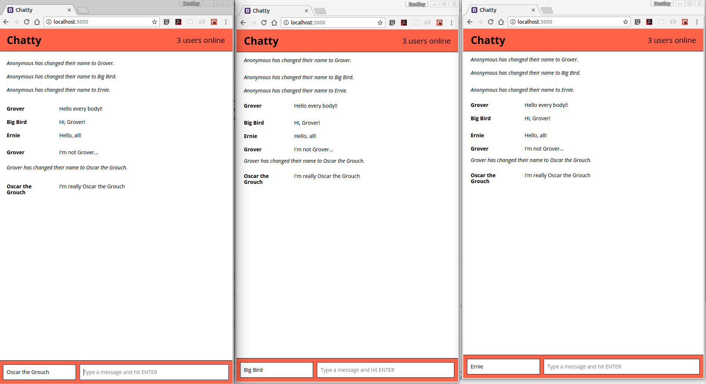

Chatty App
=====================

A first look at React and Websockets.

## Usage

Clone the github repo.

Install the dependencies and start Chatty App.
Chatty App runs on port 3000 by default.

```
npm install
npm start
```
Start the Websocket server.
The Websocket server runs on port 3001 by default in order to avoid conflicts with Chatty App
```
cd chattyserver
node server.js
```

## Dependencies

Look in package.json you lazy bum!

## Screenshots
